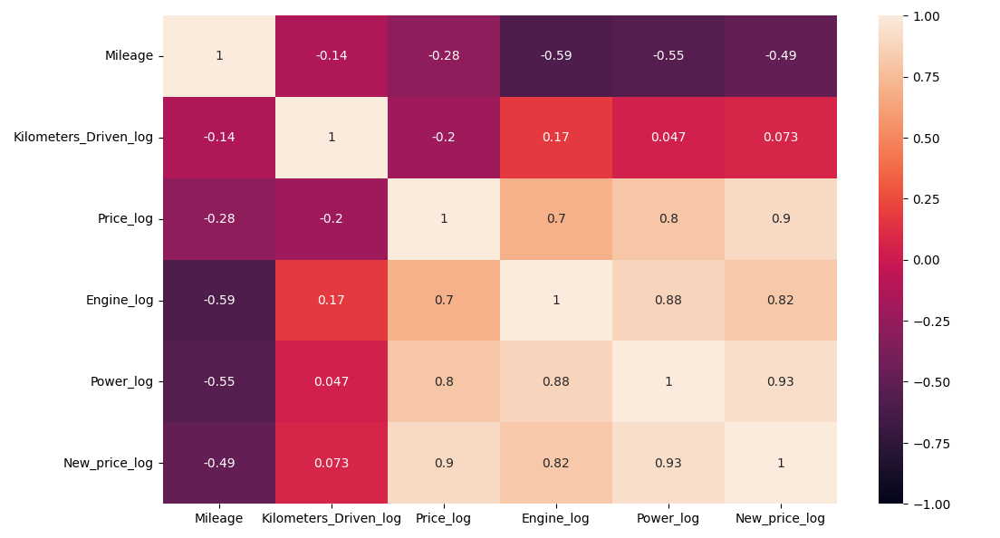

# Used Cars Price Prediction

## Project Overview

This project develops and compares machine learning models to predict the prices of used cars.

The analysis was conducted for Cars4U, a used-car business that wants to provide reasonable and competitive prices to buyers and sellers. The project explores the factors associated with used-car prices, prepares the data for modeling, compares several regression techniques, and evaluates which model provides the most reliable predictions.

## Business Objective

Used-car prices depend on many characteristics, making it difficult to estimate a reasonable price without analyzing historical data.

The goals of this project were to:

- Identify the variables most strongly associated with used-car prices
- Build predictive models for estimating unknown car prices
- Compare several machine learning approaches
- Evaluate model performance on unseen data
- Recommend a model that Cars4U could use as a pricing-support tool

## Dataset

The dataset contains 7,253 used-car records and 14 variables.

Important variables include:

- `Name` – Brand and model of the car
- `Location` – City where the car is available
- `Year` – Manufacturing year
- `Kilometers_Driven` – Total kilometers driven
- `Fuel_Type` – Petrol, Diesel, Electric, CNG, or LPG
- `Transmission` – Automatic or Manual
- `Owner_Type` – Ownership category
- `Mileage` – Vehicle mileage
- `Engine` – Engine displacement in CC
- `Power` – Maximum engine power in bhp
- `Seats` – Number of seats
- `New_price` – Price of the same model when new
- `Price` – Used-car price and target variable

## Data Preparation

The data was prepared for machine learning through several preprocessing steps, including:

- Examining missing values and data types
- Cleaning numerical fields
- Extracting useful information from vehicle names
- Handling missing values
- Applying transformations to skewed numerical variables
- Encoding categorical variables
- Preparing training and test datasets
- Log-transforming selected variables, including the target price

## Exploratory Data Analysis

Exploratory analysis was used to understand the variables associated with used-car prices.

Key areas investigated included:

- Price distributions
- Vehicle age and price
- Engine power and price
- Mileage and price
- Kilometers driven
- Fuel type
- Transmission type
- Ownership history
- Correlations among numerical variables

## Key Findings

### Factors Associated With Price

The correlation analysis indicated that:

- `Engine`
- `Power`
- `New_price`

had some of the strongest positive relationships with used-car price.

`Mileage` and `Kilometers_Driven` showed weaker correlations with price.

Vehicle year and kilometers driven also contributed useful information when building the tree-based models.

## Models Evaluated

Five regression approaches were compared:

- Linear Regression
- Ridge Regression
- Lasso Regression
- Decision Tree Regression
- Random Forest Regression

Models were evaluated using:

- R²
- Root Mean Squared Error (RMSE)
- Training performance
- Test performance

## Model Performance

| Model | Train R² | Test R² | Train RMSE | Test RMSE |
| --- | ---: | ---: | ---: | ---: |
| Linear Regression | 0.931 | 0.880 | 2.965 | 3.763 |
| Ridge Regression | 0.923 | **0.891** | 3.127 | **3.591** |
| Lasso Regression | -0.002 | 0.003 | 11.296 | 10.836 |
| Decision Tree | 0.992 | 0.815 | 1.000 | 4.664 |
| Random Forest | 0.975 | 0.870 | 1.797 | 3.917 |

## Model Selection

Ridge Regression was selected as the most suitable model for this project.

The model achieved:

- **Test R²: approximately 0.89**
- **Test RMSE: approximately 3.59**

Compared with the other models, Ridge Regression provided a strong balance between predictive performance and consistency between the training and test datasets.

Decision Tree and Random Forest achieved very strong training performance but showed larger differences between training and test performance, indicating greater overfitting.

## Featured Visualizations

### Correlation Heatmap

The heatmap was used to identify relationships between numerical vehicle characteristics and used-car price.

---

### Power vs Price

This visualization shows the relationship between vehicle power and used-car price.

---

### Ridge Regression: Actual vs Predicted Prices

The actual-versus-predicted plot shows how closely Ridge Regression estimates used-car prices compared with observed prices.

## Business Recommendations

- Use the Ridge model as a starting point for estimating reasonable used-car prices.
- Allow buyers and sellers to explore how characteristics such as year, mileage, and kilometers driven affect estimated price.
- Continue monitoring model performance as market conditions change.
- Update the model as additional and more recent vehicle data becomes available.
- Combine model predictions with human judgment rather than treating predictions as absolute prices.

## Limitations

The model should be treated as a decision-support tool rather than a complete replacement for human pricing decisions.

Potential limitations include:

- Prediction error remains present despite the model's strong R²
- Extreme outliers can affect predictions
- Some real-world market factors are not represented in the dataset
- Economic conditions such as inflation, interest rates, supply, and exchange rates may affect real-world vehicle prices

## Tools and Libraries

- Python
- Pandas
- NumPy
- Matplotlib
- Seaborn
- Scikit-learn
- Jupyter Notebook / Google Colab

## Skills Demonstrated

- Data cleaning and preprocessing
- Exploratory Data Analysis
- Feature transformation
- Missing-value handling
- Regression modeling
- Regularization
- Linear Regression
- Ridge Regression
- Lasso Regression
- Decision Trees
- Random Forest
- Model evaluation
- Train-test validation
- Overfitting analysis
- Business recommendations
